# Install PHP on MacOS

## Basic variant with MAMP

1. Download MAMP application from web site [https://www.mamp.info/en/](https://www.mamp.info/en/)
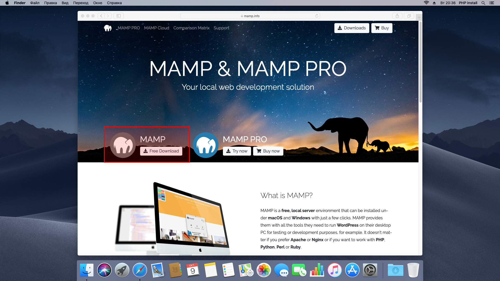

2. Install MAMP
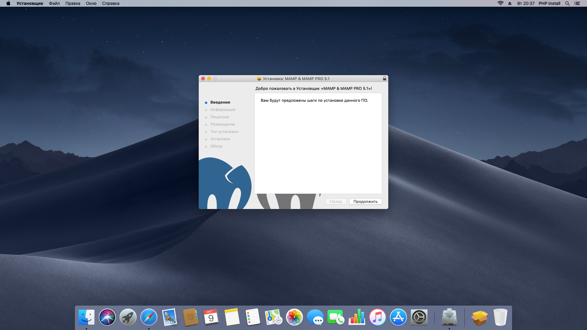
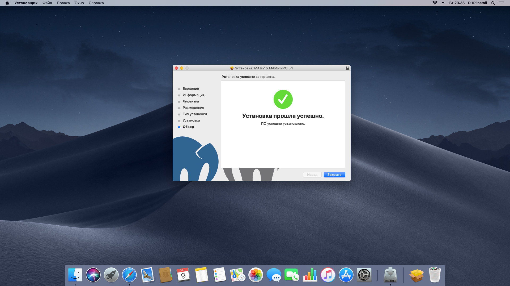

3. Run [MAMP](file:///Applications/MAMP/MAMP.app) application from [Application folder](file:///Applications/MAMP/)
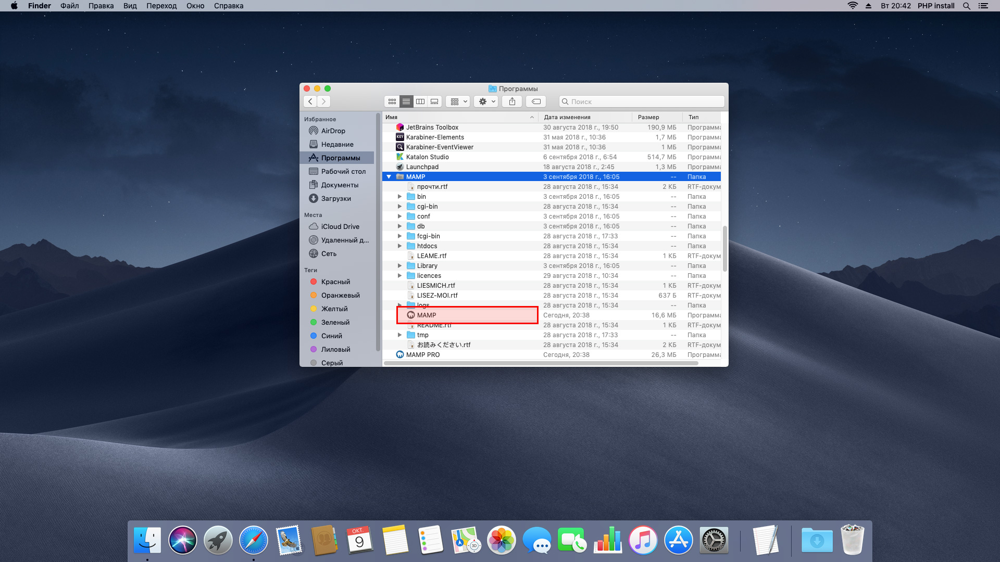

4. You can see path to webroot into Preferences
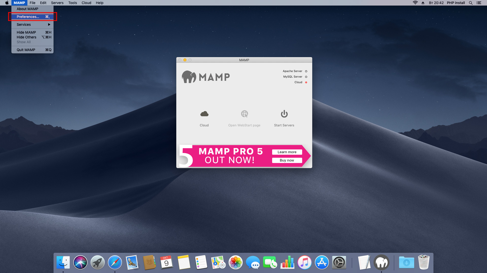
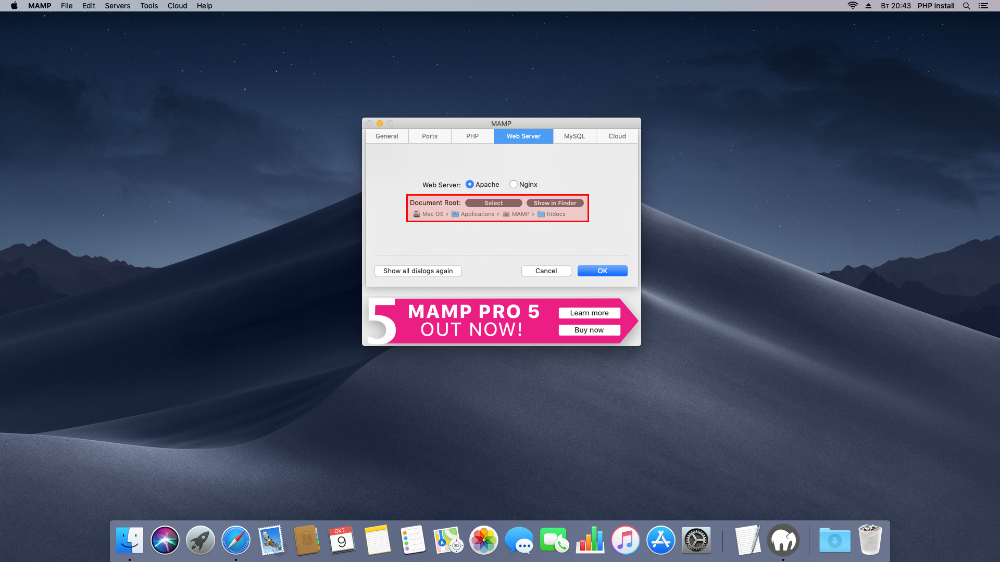

5. Start the web server
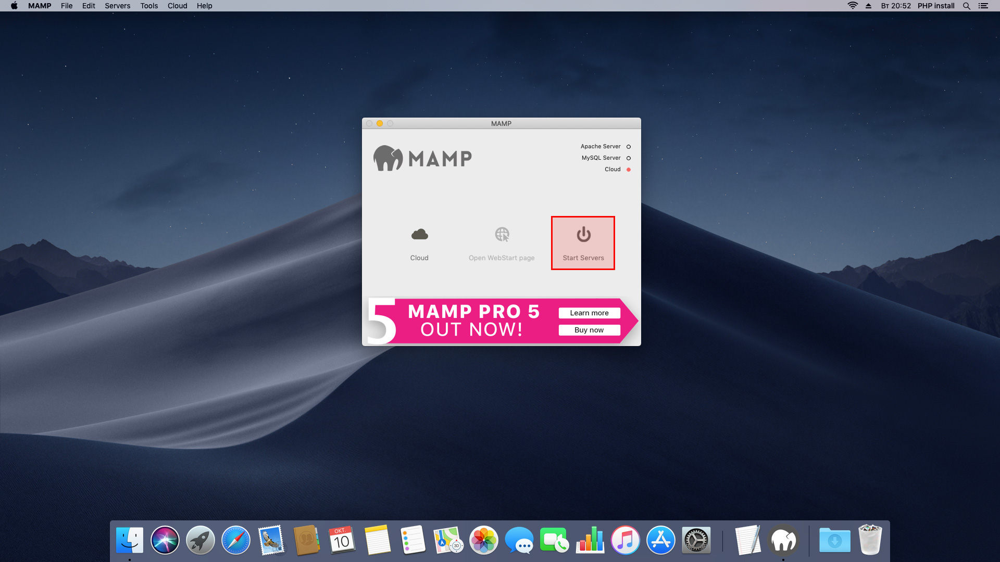

6. Put your project files into Document root. By default it's [`file:///Applications/MAMP/htdocs`](file:///Applications/MAMP/htdocs)
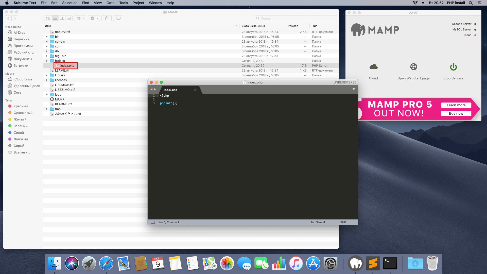

7. Make sure the webserver is running and open WebStart page. By default it's [here](localhost:8888/MAMP/)
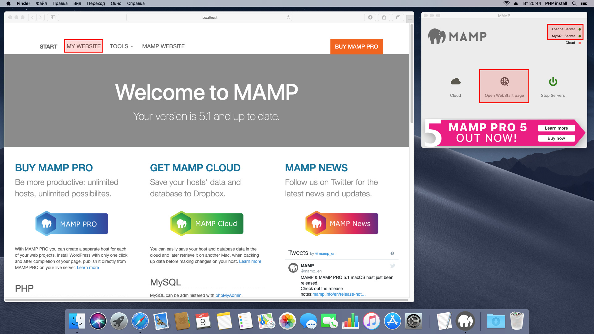

8. Make sure your the browser show correctly web address
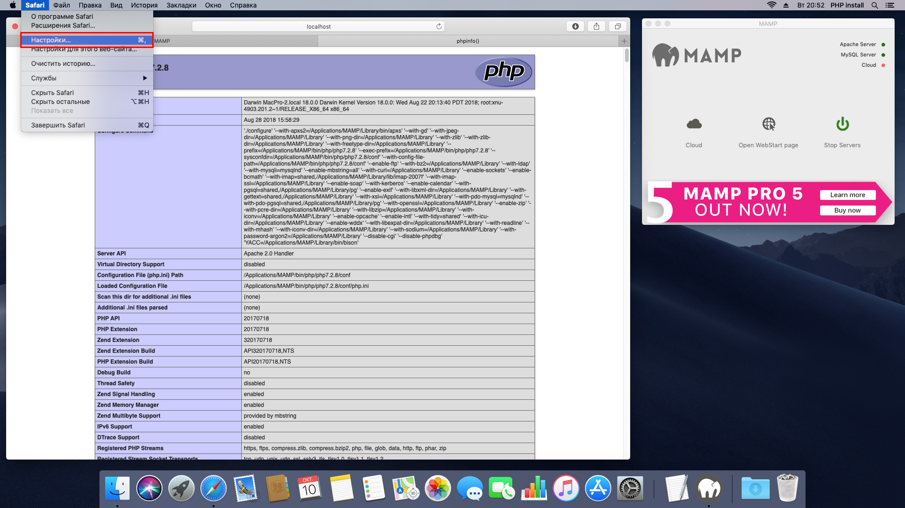
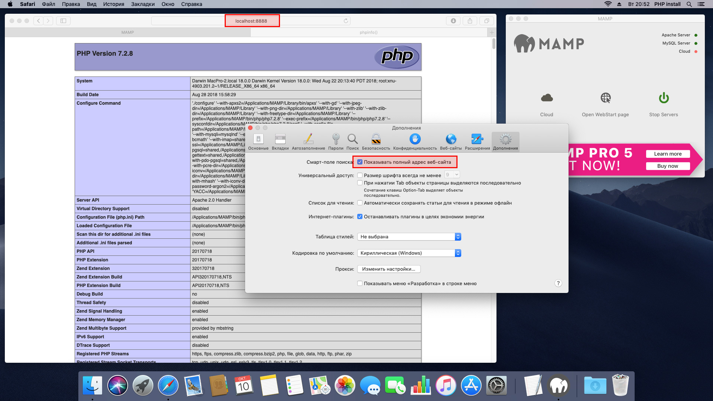

9. Open PhpMyAdmin from WebStart page, if you need design your databases. By default it's [here](http://localhost:8888/phpMyAdmin/)
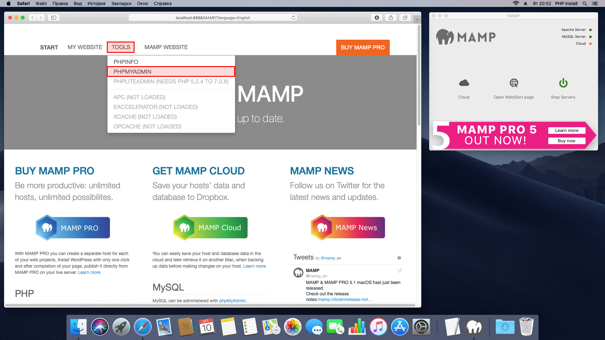
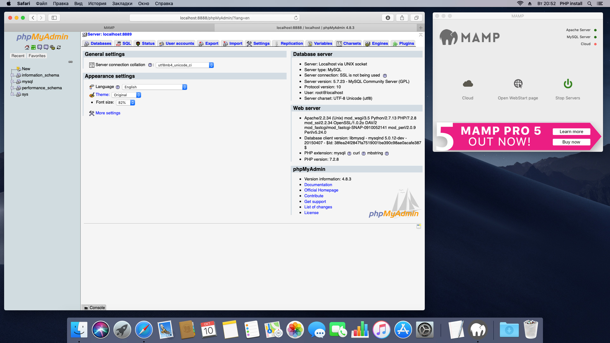

